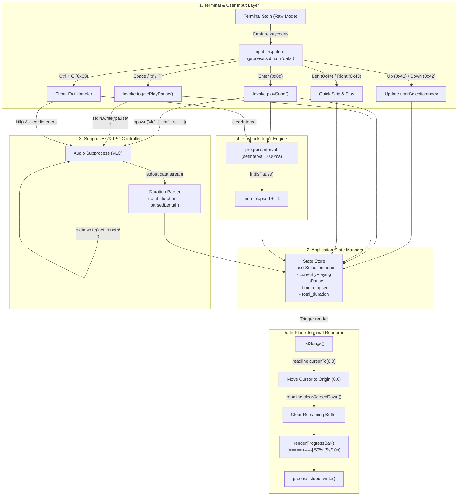

# CLI Music Player — Refinement Challenge Submission

**Author / Developer:** Mayank Sharma  
**Project:** CLI Song Application (`cli_song_app`)  
**Stack:** Node.js (v18+), child_process (`spawn`), readline, raw stdin stream, ANSI terminal control, VLC remote control interface.

---

## 1. Architecture Diagram

### Architectural Component Breakdown:
1. **Raw Stdin Input Handler (`process.stdin.setRawMode(true)`)**:
   - Bypasses standard line-buffering, capturing every keystroke in real-time as raw hex buffers without requiring the user to press Enter after every action.
2. **Audio Process Controller (`child_process.spawn`)**:
   - Manages playback through standard I/O pipes using VLC's headless remote control interface (`--intf rc --play-and-exit`).
   - Sends non-blocking ASCII commands (`pause\n`, `get_length\n`) via `stdin` and parses asynchronous response events via `stdout`.
3. **Timer & State Synchronizer (`setInterval`)**:
   - A 1-second interval increments `time_elapsed` only when `!isPause`. It synchronizes the UI progress bar with audio playback.
4. **In-Place Terminal Renderer**:
   - Uses ANSI escape sequences via `readline.cursorTo(process.stdout, 0, 0)` and `readline.clearScreenDown(process.stdout)` to overwrite the terminal screen in-place, eliminating scrolling, flickering, and ghost characters.
5. **Lifecycle & Resource Cleanup**:
   - Prevents orphaned processes, audio overlap, and memory leaks by killing previous child processes and clearing active timers on track switch or `Ctrl+C`.

---

## 2. AI Chat History & Refinement Log

- **Initial State Analysis**: Evaluated existing class code that relied on `afplay` with basic console printing. Identified issues with process stalling, lack of real pause/resume, and terminal scrolling on every arrow keypress.
- **IPC Architecture Design**: Explored alternatives to OS signal handling (`SIGSTOP`/`SIGCONT`), adopting VLC's remote control line interface (`--intf rc`) for bi-directional stdio communication.
- **Terminal UI Refinement**: Replaced standard multi-line console output with in-place ANSI cursor positioning and line clearing to ensure smooth, flicker-free rendering.
- **Progress Bar Math**: Engineered a percentage-based progress bar calculating dynamic ratio `Math.min(1, time_elapsed / total_duration)` with visual filled/unfilled indicators and explicit percentage readouts.
- **Edge Case Hardening**: Added cleanup handlers on `process.on('exit')` and `rawUserInput[0] === 0x03` (`Ctrl+C`) to prevent audio hanging in the background.

---

## 3. Understanding Questionnaire (Answers)

### **Q1. Your first arrow-navigation version printed the song list again and again. Why did that happen, and how did you make the list redraw in the same place?**
> **Answer:** Standard terminal output (`console.log`) appends new characters followed by a newline (`\n`), advancing the cursor downward on the terminal grid. Whenever a keypress event was received, the program called the render function, writing a fresh list block below the previous one and causing continuous downward scrolling.
> 
> To redraw in the same place, we move the terminal cursor back to the top-left origin (position `(0, 0)`) using ANSI escape sequences (or `readline.cursorTo(process.stdout, 0, 0)`) and overwrite the existing lines, preventing repeated appended lists.

---

### **Q2. Why do we need both cursor movement and line clearing while redrawing the terminal UI? What problem can happen if we only move the cursor?**
> **Answer:** Moving the cursor repositions where writing begins, but does not erase existing text. If a new string is shorter than the text previously on that line (for example, switching from `"1. A Very Long Song Title.mp3"` to `"2. Short.mp3"` or updating status messages), the leftover characters from the previous string remain visible at the end of the line (known as **text ghosting** or artifacting). Line clearing (e.g., ANSI code `\x1b[K` or `readline.clearLine`) wipes the line clean before writing new content.

---

### **Q3. What does the selected-song variable represent? How do you make sure the user cannot move above the first song or below the last song?**
> **Answer:** The selected-song variable (`userSelectionIndex`) is an integer pointer representing the 0-based array index of the highlighted song in the `songs` list.
> 
> To prevent moving out of bounds:
> - Moving Up: `userSelectionIndex = Math.max(0, userSelectionIndex - 1)`
> - Moving Down: `userSelectionIndex = Math.min(songs.length - 1, userSelectionIndex + 1)`
> 
> This clamps the index between `0` (first song) and `songs.length - 1` (last song). Alternatively, wrap-around navigation can be achieved using modulo arithmetic: `(userSelectionIndex + 1) % songs.length`.

---

### **Q4. Why was afplay + SIGSTOP/SIGCONT not a reliable solution for a real pause/resume feature? What changed in your final approach?**
> **Answer:** `afplay` is a non-interactive command-line tool with no stdin/IPC command interface. Pausing it via OS signals (`SIGSTOP` to freeze and `SIGCONT` to continue) stops process scheduling at the kernel level, but causes audio buffer underruns, desyncs with JavaScript elapsed timers, audio hardware channel locks on macOS, and offers no way to query track duration or current seek timestamp.
> 
> **What changed:** We transitioned to a player supporting real-time remote control via standard I/O (such as VLC with `--intf rc` or MPV with IPC). This allows sending non-blocking commands (`pause\n`, `get_length\n`) through `stdin` and parsing structured feedback through `stdout`.

---

### **Q5. How would you prove that your pause/resume implementation is correct? Describe a small test you would perform.**
> **Answer:**
> 1. Select and play a track; let it play for 5 seconds (progress bar shows `5s`).
> 2. Press `p` / `Space` to pause at `5s`. Observe that audio stops instantly, UI displays `Currently Paused`, and the timer freezes at `5s`.
> 3. Wait for 10 seconds in the paused state. Confirm the timer does not increment and remains at `5s`.
> 4. Press `p` / `Space` to resume.
> 5. Confirm audio resumes from the exact 5-second position without popping, stuttering, or restarting from 0:00.

---

### **Q6. How is the progress percentage calculated? What should happen to the progress value while the song is paused?**
> **Answer:**
> - **Formula:** `percentage = total_duration > 0 ? Math.min(100, Math.round((time_elapsed / total_duration) * 100)) : 0`
> - **When Paused:** The `progressInterval` timer callback checks `!isPause`. When `isPause === true`, `time_elapsed` does not increment, and the percentage remains fixed at its exact pause value.

---

### **Q7. When the user starts a new song while another song is already playing, what needs to be stopped or cleaned up? What could happen if you do not do this?**
> **Answer:**
> - **What must be cleaned up:**
>   1. Kill the active audio subprocess (`currentProcess.kill('SIGTERM')`).
>   2. Remove attached process listeners (`currentProcess.removeAllListeners('exit')`) to prevent stale exit callbacks from resetting new state.
>   3. Clear active timer intervals (`clearInterval(progressInterval)`).
>   4. Reset tracking variables (`time_elapsed = 0`, `total_duration = 0`, `isPause = false`).
> - **Consequences if omitted:** Multiple songs play simultaneously over each other, zombie child processes accumulate in memory, and overlapping timer intervals cause UI progress bars to jump erratically and flicker.

---

### **Q8. Describe one bug or unexpected behaviour you faced while refining this application. What did you initially think was wrong, how did you investigate it, and what was the actual fix?**
> **Answer:**
> - **Bug:** When querying track duration from the VLC remote control interface (`get_length`), `total_duration` remained `0` or was parsed as `NaN`.
> - **Initial thought:** VLC was failing to read the metadata of the MP3 files.
> - **Investigation:** Logged the raw data chunks received on `stdout` (`console.log(JSON.stringify(chunk.toString()))`) and discovered VLC prepends the prompt string `> ` before each response (e.g. `> 180\r\n> `).
> - **Fix:** Sanitized stdout chunks by stripping `>` characters, splitting lines by regex `[\r\n]+`, and parsing the first valid positive integer.

---

### **Q9. If you had to add "jump forward 10 seconds" next, which part of your current application would you change and what existing playback information would you reuse?**
> **Answer:**
> - **Changes:**
>   1. Add a key event check in `process.stdin.on('data')` (e.g. for key `f` or `]` or `Shift + Right Arrow`).
>   2. Send the seek command to the audio player's stdin: `currentProcess.stdin.write('seek +10\n')` (or `time ${time_elapsed + 10}\n`).
>   3. Update state: `time_elapsed = Math.min(total_duration, time_elapsed + 10)`.
>   4. Trigger an immediate UI re-render with `listSongs(SONGS_DIR)`.
> - **Reused Information:** Reuses `currentProcess.stdin` for IPC communication, `time_elapsed` for current position offset, and `total_duration` for upper-bound clamping.
